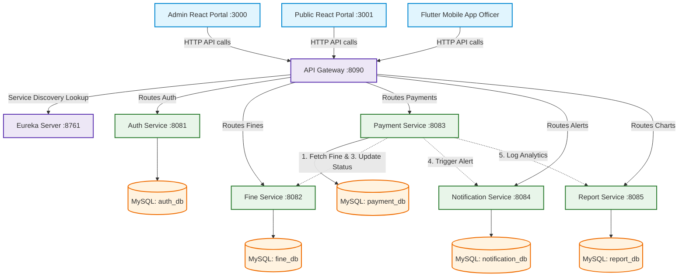

# Sri Lanka Police Traffic Fine Management System

A distributed, microservices-based Traffic Fine Management System developed for the Software Architecture module. It enables administrators to manage traffic officers and categories, allows officers to issue traffic violation tickets, and lets drivers query and pay their fines instantly over the web or mobile.

---

## 🏛️ System Architecture

The project is built on a decoupled **Database-per-Service microservice architecture** using **Spring Boot & Spring Cloud** for the backend, **React + Vite** for the web frontends, and **Flutter** for the mobile application.



### 📐 Architectural Breakdown

1. **Service Registration & Discovery (Eureka Server)**:
   Acts as the lookup directory. On startup, all microservices register their dynamic IP and ports here. Other services query Eureka to find and connect to peer microservices without hardcoded configurations.
2. **Central Entry Point (API Gateway)**:
   Routes all external requests from mobile apps and web frontends to the correct microservice using Eureka registration names (load balanced). Handles CORS preflight and keeps internal service ports secure.
3. **Database-per-Service Pattern (MySQL)**:
   Each microservice owns a dedicated MySQL database schema. No direct cross-service database access is allowed. Data sharing is strictly managed via REST APIs.
4. **Inter-Service Data Flow (Example: Fine Payment)**:
   * Citizen queries fine from **Public Portal** -> goes through **API Gateway** -> hits **Fine Service**.
   * Citizen submits payment -> hits **Payment Service**, which calls **Fine Service** internally via `RestTemplate` (registered with `@LoadBalanced`) to fetch ticket details and verify the payment amount.
   * On successful transaction, **Payment Service** updates status in **Fine Service**, logs dispatch events in **Notification Service** (for SMS), and publishes metric records to **Report Service**.

---

## 👥 Project Work Distribution (6-Member Team)

To manage development efficiently, the project is structured and divided among **6 team members** as follows:

### 🧑‍💻 Member 1: System Integration & DevOps Engineer
* **Core Responsibilities:** Central routing infrastructure, database orchestration, and system compile scripts.
* **Key Tasks:**
  * Configured and initialized the **Eureka Service Registry**.
  * Developed the **API Gateway** with service path predicates and CORS policies.
  * Designed the local **MySQL Database-per-Service** setup and automated connection profiles.
  * Maintained parent `pom.xml` dependency mappings and handled microservice startup ordering.

### 🧑‍💻 Member 2: Security & Authentication Engineer
* **Core Responsibilities:** User access control, identity lifecycle, and API security.
* **Key Tasks:**
  * Built the **Auth Service** to handle user registration, credential storage, and password hashing.
  * Implemented role-based authorization (Separation of **Admin** and **Police Officer** user models).
  * Implemented **JWT (JSON Web Tokens)** validation filters across the Gateway to secure API routes.
  * Seeded the default admin accounts into `auth_db`.

### 🧑‍💻 Member 3: Traffic Fine & Violation Service Engineer
* **Core Responsibilities:** Violation parameters, ticket generation, and status states.
* **Key Tasks:**
  * Developed the **Fine Service** core logic, handling traffic tickets and status updates.
  * Created fine ticket registration and query REST APIs.
  * Programmed the preloading and seeding of Sri Lanka Police fine categories (Speeding, Drunk Driving, etc.) in `fine_db`.
  * Designed logic to block updating ticket states once a fine is marked as `PAID`.

### 🧑‍💻 Member 4: Transactions, Auditing & Notification Service Engineer
* **Core Responsibilities:** Monetary transactions, audit trail compilation, and notification dispatches.
* **Key Tasks:**
  * Developed the **Payment Service** to simulate credit card processing and record payment transactions in `payment_db`.
  * Integrated internal `RestTemplate` calls to update fine ticket states downstream in the **Fine Service**.
  * Developed the **Notification Service** to track communication events and log SMS/Email dispatches in `notification_db`.
  * Implemented transaction rollbacks (`@Transactional`) in the event of payment failure to ensure strict data consistency.

### 🧑‍💻 Member 5: Frontend Web Developer
* **Core Responsibilities:** Web UI design, analytics visualization, and driver settlement portal.
* **Key Tasks:**
  * Developed **Admin Portal** (`frontend-admin` in React/Vite) for police admins to manage officers and categories.
  * Developed **Public Portal** (`frontend-public` in React/Vite) for citizens to search tickets and checkout.
  * Built the interactive analytics dashboard charts in the Admin Portal using APIs connected to the **Report Service**.
  * Implemented responsive mock payment forms with error validation states.

### 🧑‍💻 Member 6: Mobile Application Developer
* **Core Responsibilities:** Officer mobile client application and field deployment.
* **Key Tasks:**
  * Developed the **Flutter Mobile App** (`mobile-app`) for traffic officers on the road.
  * Designed the mobile authentication UI integrating with the **Auth Service** APIs.
  * Created the fine issuance interface allowing officers to select violation categories and enter driver details.
  * Integrated mobile HTTP clients to publish issued fines to the backend via the API Gateway.

---

## 🛠️ Prerequisites

Before launching the project, ensure you have the following installed:
* **Java JDK 17** (LTS)
* **Apache Maven 3.9+**
* **Node.js 20+ & npm**
* **Flutter SDK 3.19+**
* **MySQL Server 8.0+** (Listening on port `3306`)

---

## 🚀 How to Run the Project (Step-by-Step)

### Step 1: Run the Backend Microservices
Open a terminal in the project root directory, and launch the services in order. Wait a few seconds between each command for startup registration:

1.  **Start Eureka Registry**:
    ```bash
    mvn -pl eureka-server spring-boot:run
    ```
2.  **Start Core Microservices**:
    Launch the following in separate terminal sessions:
    ```bash
    mvn -pl auth-service spring-boot:run
    ```
    ```bash
    mvn -pl fine-service spring-boot:run
    ```
    ```bash
    mvn -pl payment-service spring-boot:run
    ```
    ```bash
    mvn -pl notification-service spring-boot:run
    ```
    ```bash
    mvn -pl report-service spring-boot:run
    ```
3.  **Start API Gateway**:
    ```bash
    mvn -pl api-gateway spring-boot:run
    ```

*Verify the services status by visiting the Eureka Dashboard at **[http://localhost:8761](http://localhost:8761)** (All 6 services should register as `UP`).*

---

### Step 2: Start the Web Portals
Run the portals using the following commands:

*   **Admin Portal** (`frontend-admin`):
    Navigate to `frontend-admin`, install packages, and start the Vite dev server:
    ```bash
    npm install
    npm run dev
    ```
    *Access the portal at **[http://localhost:3000](http://localhost:3000)** (Default Login: `admin` / `admin123`).*

*   **Public Settlement Portal** (`frontend-public`):
    Navigate to `frontend-public`, install packages, and start:
    ```bash
    npm install
    npm run dev
    ```
    *Access the portal at **[http://localhost:3001](http://localhost:3001)**.*

---

### Step 3: Run the Mobile Application
Navigate to the `mobile-app` directory and pull packages:
```bash
flutter pub get
```
*You can launch the app on an Android Emulator or connected physical device using `flutter run` or via your IDE.*

---

## 💳 Demo Verification Flow
1.  Open the **Admin Portal** on `http://localhost:3000` and login (`admin`/`admin123`).
2.  Go to the **Register Officer** tab and create a new officer account (e.g., Username: `PC1001`, Badge: `B8821`). The default password will be `PC1001123`.
3.  Issue a fine ticket. (Either via the mobile app, or by logging in as `PC1001` and calling the REST API).
4.  Open the **Public Portal** on `http://localhost:3001` and search for your fine ticket reference.
5.  Proceed to checkout, enter mock card details, and pay. The ticket status will update to `PAID` instantly across all services and reflect on the Admin Dashboard analytics charts!
